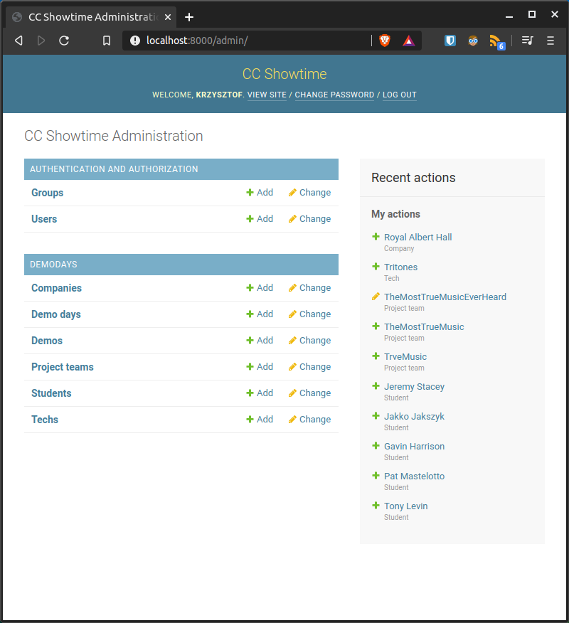
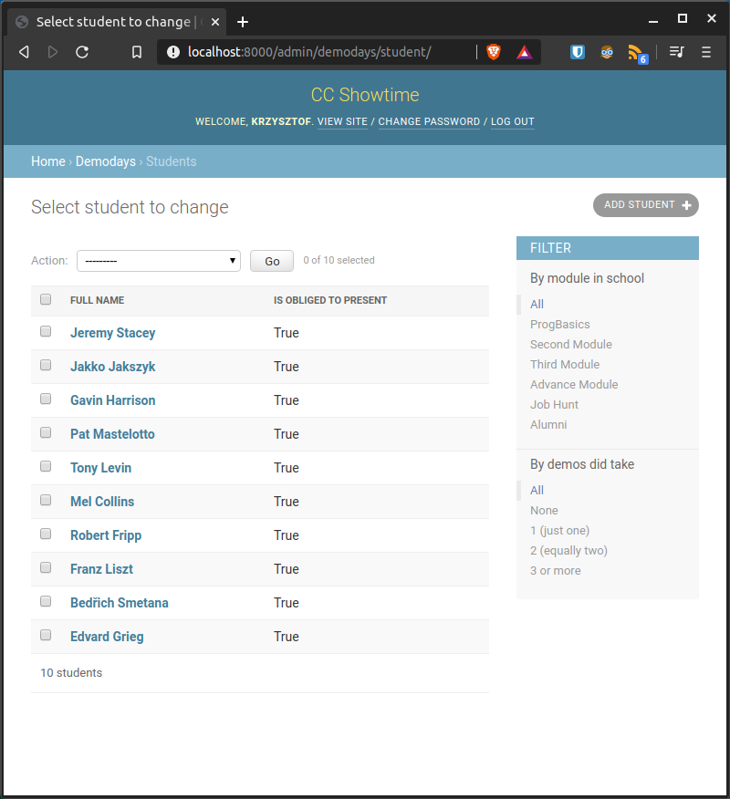
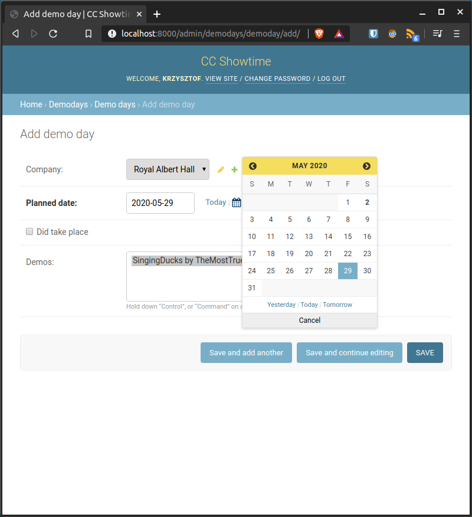
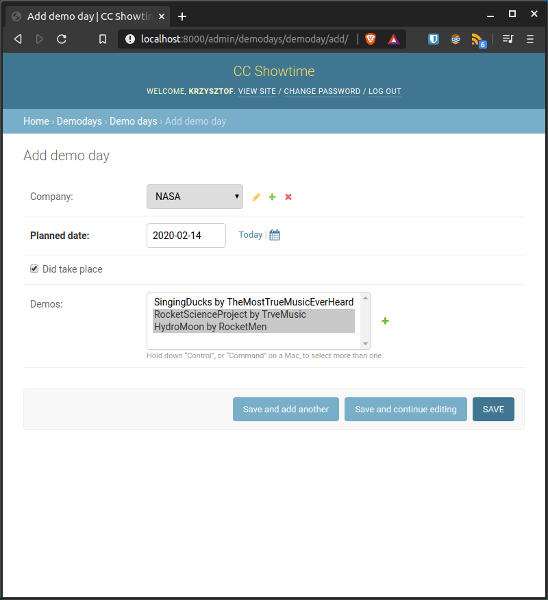
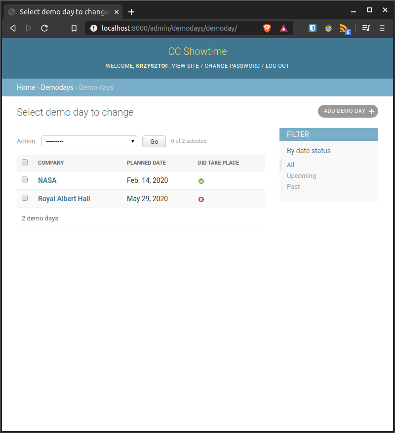

# Codecooler's Showtime  
Web application designed to track the activity of [Codecool](https://codecool.com/pl/) students during weekly frontal presentations.  
  
## Table of contents  
* [General info](#general-info)  
* [User stories](#user-stories)  
* [Screenshots](#screenshots)  
* [Technologies](#technologies)  
* [Setup](#setup)  
* [Features](#features)  
* [Status](#status)  
* [Contact](#contact)  
  
## General info  
My mentor, Adam, asked me if I would help him automate his work. The task was to transform the spreadsheet into an application. The main goal of the application is to find students who have never presented their project or presented only once.  
  
## User stories  
Before starting work, I collected the needs of the target user (Adam) and prepared user stories. Link to this document is [here](documentation/user-stories-1-0-0.md).  
  
## Screenshots  
  

  

  

  

  
  
## Technologies  
* Python 3.8.2  
* Django 3.0.5  
* PostgreSQL 12.2  
* Heroku 7.40.0  
  
## Setup  
### Deployed app  
The application is deployed on Heroku, [here](https://ccshowtime.herokuapp.com/).  
  
### Linux Ubuntu 18+  
If you want to configure local environment to run this project locally, you must have Python version 3.6+ and PostgreSQL 10.12+. To start clone the project to your machine:  
```bash
git clone git@github.com:kMatejak/cc-showtime.git YYY
cd YYY
```  
Then create a virtual environment and install all requirements. `virtualenv` is used to isolate python modules so they don't pollute your system.  
```bash
virtualenv XXX
source XXX/bin/activate
pip install -r showtime/requirements.txt
```  
Create new postgres database, for example via `psql`:  
```sql
CREATE DATABASE zzz;
CREATE USER admin_zzz WITH PASSWORD 'password1234' CREATEDB;
GRANT ALL PRIVILEGES ON DATABASE zzz TO admin_zzz; 
ALTER DATABASE zzz OWNER TO admin_zzz;
```
CREATEDB is necessary Django for testing purposes.  
  
And now configure connection in `showtime/showtime/settings.py`, for example:  
```python
DATABASES = {
    'default': {
        'ENGINE': 'django.db.backends.postgresql',
        'NAME': 'zzz',
        'USER': 'admin_zzz',
        'PASSWORD': 'password1234',
        'HOST': 'localhost',
        'PORT': '',
        'TEST': {
            'NAME': 'zzz_test_database',
        }
    }
}
```
Create a database structure by performing existing migrations on your database and create a superuser:
```bash
python manage.py migrate
python manage.py createsuperuser
```  
And finnally run project in your web browser by typing:
```bash
python manage.py runserver
```  

For more about developing Django projects see the documentation, [here](https://docs.djangoproject.com/en/stable/). 
  
## Features  
List of features ready and TODOs for future development  
* Dividing events (DemoDay) into smaller objects in relationships with each other - dynamically adding a Demo once created to various DemoDays  
* Sorting students by modules (classes) in which they are  
* Sorting students by activity  
  
To-do list:  
* Import students data from Codecool API  
* Export data from the application to the school Google Calendar  
  
## Status  
Project is: _in progress_  
MVP is ready and the app is delpoyed [here](https://ccshowtime.herokuapp.com/).  
    
## Contact  
Created by [@kMatejak](https://www.linkedin.com/in/matejak/) - feel free to contact me!  
  
